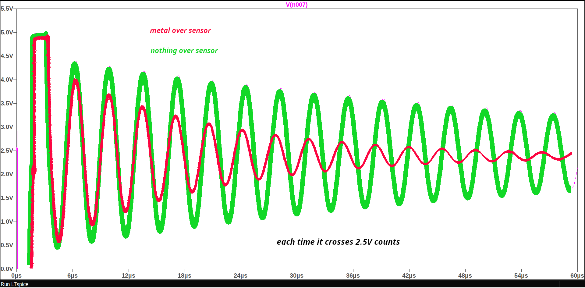
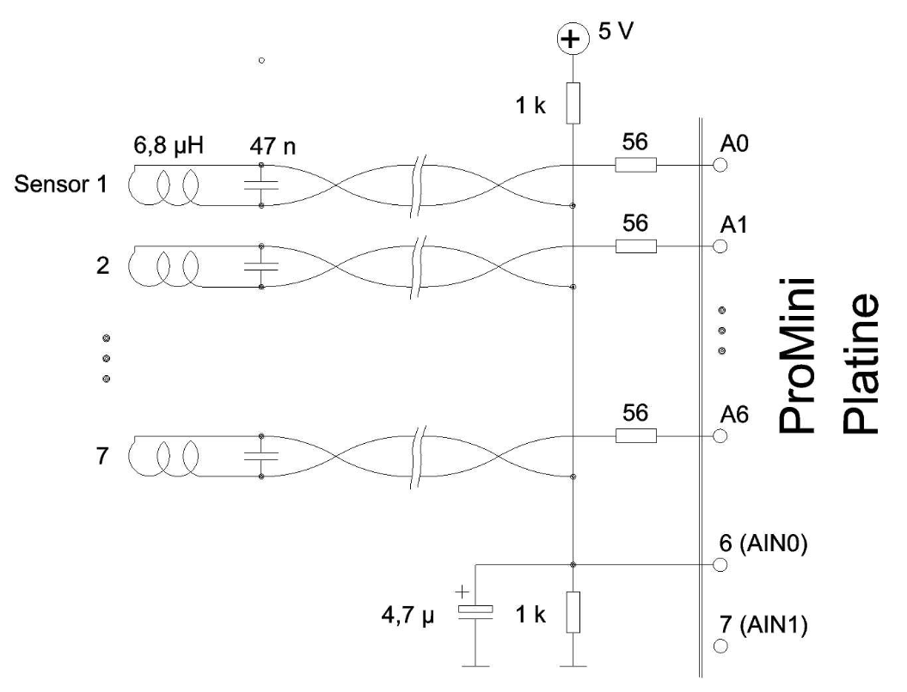
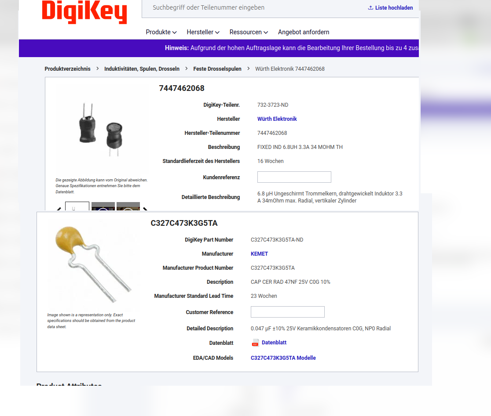
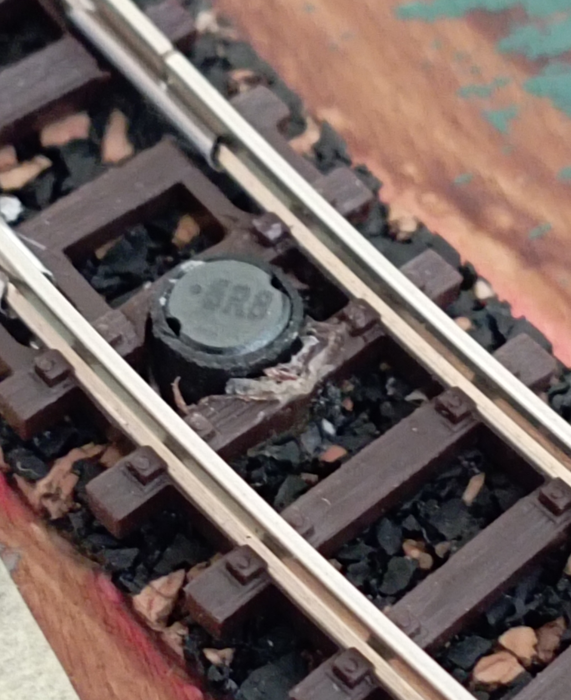

## License
The software includes about 45 lines of the MIT licensed software 
    "Schrankensteuerung Zustandsautomat Schrankenbewegung"
            Copyright (c) 2025 Albert Messmer

MIT License

Copyright (c) 2026 Andreas Mascheck

## Description
Library to use an Arduino Nano as a 7 channel LC proximity sensor

---

## ⚠️ Hardware Considerations

This project **requires physical I2C pins**:

| MCU              | I2C Pins       | Available LC Inputs |
|------------------|----------------|---------------------|
| ATmega328P       | A4 (SDA), A5 (SCL) | A0–A3              |
| ATmega328PB      | A4/A5 + SDA1 (D23), SCL1 (D24) | More flexible |

- Newer Nano boards with **ATmega328PB** provide a second I2C interface  
- Availability of Nano V4 (328PB) may be limited → choose hardware carefully
>⚠️ the code for Nano V4 was only to compile with:

Arduino IDE Version: 2.3.8
>Date: 2026-02-25T15:15:50.003Z
>CLI Version: 1.4.1
>Copyright © 2026 Arduino SA

---

## 🚀 Overview

`LC_Sensor` is a library for **LC-based metal detection** for model railway occupancy sensing. 

- Sensing distance **1...3 mm**
- Supports **Arduino Nano / Pro (AVR)**
- Up to **7 proximity sensors**
- Minimal wiring: **2 wires per sensor**

---

## 🔍 Why LC Sensors?

Common alternatives have drawbacks:

| Method            | Drawback |
|------------------|----------|
| Light barriers    | Bulky, requires extra electronics |
| Hall sensors      | Require magnets on locomotives |
| Track detection   | Requires rail isolation + wiring |

### ✅ LC Sensor Advantage

- Fits into a **5.7 mm hole between rails**
- No track modification required  
- Simple wiring (twisted 0.6 mm wire)  
- Fully hidden installation  

---

## ⚙️ Features

- one analog Input at A7
- LC-based detection on analog pins

### Pin Usage

| Pin Type        | Function |
|----------------|----------|
| D6             | Reserved (internal use) |
| Digital Pins   | Input/Output (no pull-ups!) |
| A0–A6          | LC proximity inputs (virtual digital) |
| A7             | Fast analog input (0–255) |

> ⚠️ Internal pull-ups are disabled due to interference with LC oscillators and the request for pull-up will be ignored without any notice.

---

## ⏱️ Detection Principle

- Scan rate: **~400 Hz** (every 2.5 ms)  
- Sensor window: **~0.313 ms**  
- Oscillator frequency: **~280 kHz**

### Signal Evaluation

- ~150 zero crossings max per cycle  
- Trigger threshold: **36 crossings**

**Detection logic:**
- `< 36 crossings` → metal detected  
- 5 consecutive detections → valid occupancy  
- Otherwise → treated as noise  

---

## 🔧 Circuit & Components

- LC oscillator per sensor  
- Example values:
  - **Inductor:** 6.8 µH  
  - **Capacitor:** 47 nF  
- Resonance: ~280 kHz 
- see the circuit diagram 

> Higher frequencies are not recommended due to MCU interrupt limits.

---

## 📊 Visuals

- Signal simulation (train vs no train)  

- Circuit diagram (© A. Messmer)  

- Example components  

- Sensor between N scale rails

[Watch the video](pictures/ArdNano_LC_Sensor.mp4)
- Sensor between N scale rails

- Drill guider, better to make it precise without any hassle  

- soldered sensor    

*(See `/docs` or images in repository)*

---

## 📚 Documentation

---

## 💡 Notes

- Usable as **Arduino Library**
- Focused on **LC sensor inputs**
- Designed for **N-scale model railways**

---

## 📖 Reference

> “The product of inductance and capacitance must not be too small, as it determines the resonance frequency. Smaller LC values increase frequency.  
> With 6.8 µH and 47 nF, the frequency is ~280 kHz—still manageable for a 16 MHz ATmega via interrupts. Higher frequencies are not recommended.”  
> — A. Messmer, 2025

Documentation edited and improved with AI assistance (ChatGPT, OpenAI), 2026
